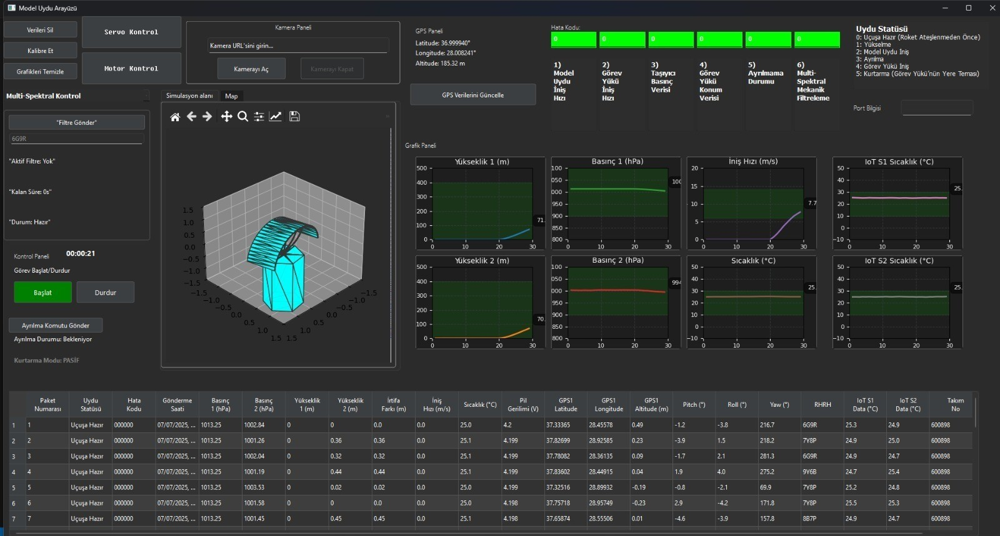

# Teknofest Model Uydu — PyQt6 Yer İstasyonu GUI

Bu depo, Teknofest Model Uydu Projesi için geliştirilen PyQt6 tabanlı yer istasyonu arayüzünü içerir.  
Arayüz; kamera kaydı, telemetri tabloları, gerçek zamanlı grafikler, 3D gyro modeli (STL), GPS/görev süresi göstergeleri, motor/servo ve multi-spektral filtre kontrolü gibi modülleri kapsar.

## Özellikler
- **Başlat/Durdur Görevi** ve görev süresi sayacı
- **Kamera** açma/kapama ve **otomatik kayıt** (görev aktifken)
- **GPS** canlı/simüle veriler ve harita resmi görüntüleme (`image.png`)
- **Telemetri Tablosu** otomatik satır ekleme ve paket numaralama
- **Gerçek Zamanlı Grafikler** (yükseklik, basınç, iniş hızı, sıcaklık, IoT sensörleri)
- **3D Gyro Modeli** (`gyro1.STL`) ile pitch/roll/yaw görselleştirme
- **Hata Kodu** hesaplama ve görsel/işitsel uyarılar
- **Motor/Servo** kontrol pencereleri (seri port üzerinden veya simülasyon)
- **Multi-Spektral Filtre** komutu (örn. `6G9R`), süre takibi ve otomatik **N** durumuna dönüş

## Kurulum
1. **(İsteğe bağlı)** Sanal ortam oluşturun ve etkinleştirin:
   ```bash
   python -m venv .venv
   # Windows
   .venv\Scripts\activate
   # macOS/Linux
   source .venv/bin/activate
   ```

2. Bağımlılıkları yükleyin:
   ```bash
   pip install -r requirements.txt
   ```

3. Uygulamayı çalıştırın:
   ```bash
   python main.py
   ```

> Not: Windows'ta sesli uyarılar `winsound` ile, macOS'ta `say`, Linux'ta `spd-say` ile tetiklenir.

## Proje Dosyaları
- `main.py` — Uygulama giriş noktası ve ana pencereyi başlatır.
- `mainwindow.py` — Ana iş mantığı, grafikler, kamera ve kontrol modülleri.
- `ui_mainwindow.py` — `mainwindow.ui`’dan üretilmiş PyQt6 arayüz sınıfı.
- `mainwindow.ui` — Qt Designer kaynak arayüz dosyası.
- `gyro1.STL` — 3D gyro modeli için STL.
- `image.png` — Harita/arka plan görseli (opsiyonel).
- `mission_time.dat` — Görev süresi kalıcılığı için (koşullu).

## Geliştirme İpuçları
- `requirements.txt` güncel tutmak için:
  ```bash
  pip freeze > requirements.txt
  ```
- PyQt Designer ile `.ui` düzenledikten sonra güncelleme:
  ```bash
  pyuic6 -x mainwindow.ui -o ui_mainwindow.py
  ```

## Lisans
MIT — ayrıntılar için `LICENSE` dosyasına bakın.

## Arayüz Görselleri

### Ana Pencere


### Grafikler ve Telemetri

